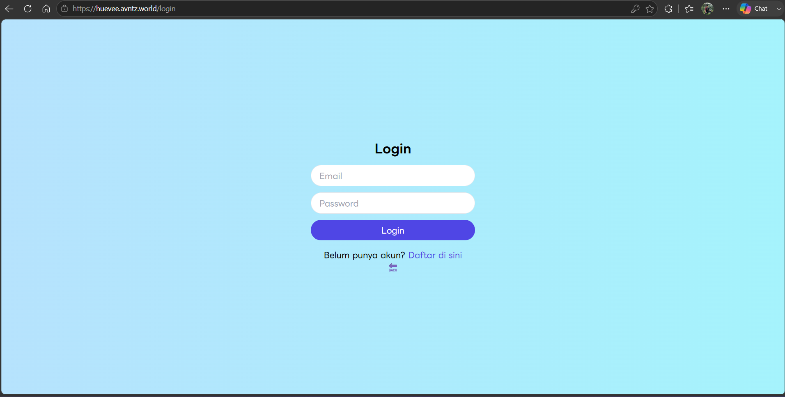
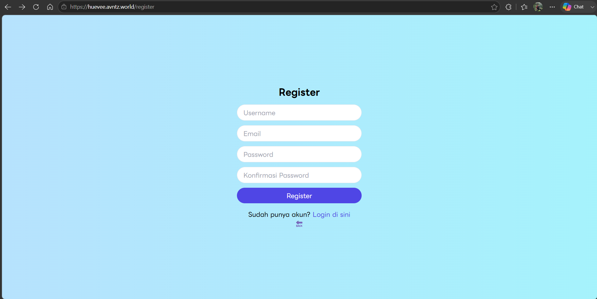
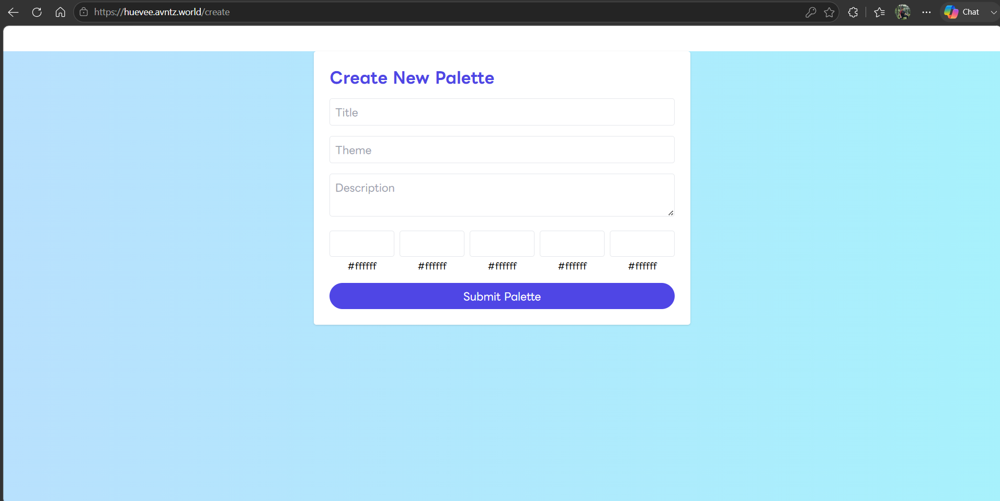
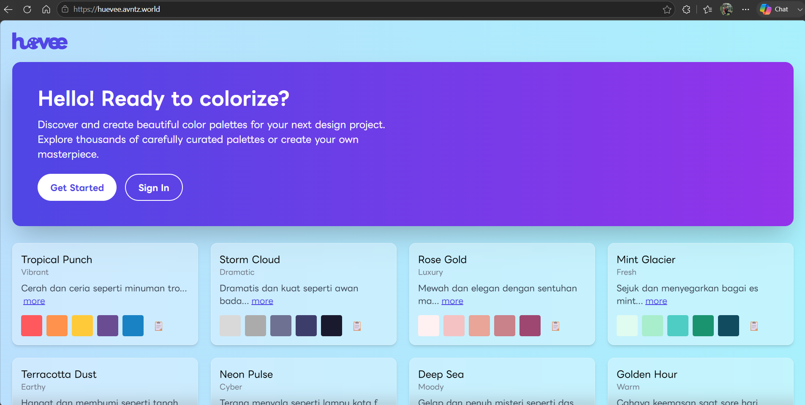
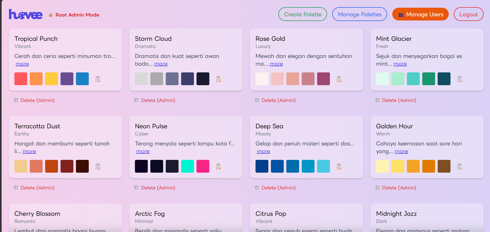

## Welcome to Huevee!


- Huevee is a web app that lets you share your palette ideas. 
- Built with React, Express, and PostgreSQL.
- Deployed on Vercel and Render.
- All of the services use free-tier resources.

### Architecture

React (Frontend)
<br>      ↓
<br>Express API (Backend)
<br>      ↓
<br>PostgreSQL Database

### Tech Stack

Frontend:
- React
- Vite
- Tailwind CSS

Backend:
- Express.js
- Node.js

Database:
- PostgreSQL

Deployment:
- Vercel
- Render

### Features
- User authentication
- Role-based authorization
- Create, edit, and delete color palettes
- Store palette data in PostgreSQL
- Responsive UI
- Admin dashboard capabilities

### How to run this app?
1. Make sure you have accounts for Vercel and Render.
2. Create a new PostgreSQL database in Render and save the hostname, DB name, password, and external database URL of the database.
3. Since Render's free tier does not provide direct SQL access, we need to connect from an external database client such as TablePlus.
4. Install TablePlus and connect into the database using the external database URL.
5. Select SQL, then create 3 tables: users, palettes, and colors using this query.
   ```
    CREATE TABLE users (
      id SERIAL PRIMARY KEY,
      username VARCHAR(50) UNIQUE NOT NULL,
      email VARCHAR(100) UNIQUE NOT NULL,
      password_hash TEXT NOT NULL,
      created_at TIMESTAMP DEFAULT CURRENT_TIMESTAMP,
      role VARCHAR(20) DEFAULT 'user'
    );
    
    CREATE TABLE palettes (
      id SERIAL PRIMARY KEY,
      user_id INTEGER REFERENCES users(id),
      title VARCHAR(100),
      theme VARCHAR(50),
      description TEXT,
      created_at TIMESTAMP DEFAULT CURRENT_TIMESTAMP
    );
    
    CREATE TABLE colors (
      id SERIAL PRIMARY KEY,
      palette_id INTEGER REFERENCES palettes(id),
      hex_code CHAR(7) NOT NULL,
      position INTEGER
    );
   ```
6. Now, create a new web service for our backend and link it to our repository. Don't forget to set the Root Directory to huevee-backend.
7. In the Build section, set the Build Command: npm install
8. In the Deploy section, set the Start Command: huevee-backend/ $ node server.js
9. Set an environment variable
   ```
   DB_HOST = (the hostname of our database in Render)
   DB_NAME = (the name of the database)
   DB_USER = the user we created in the database
   DB_PASS = the password
   NODE_ENV = production
   ```
10. Redeploy the web service; when it's ready, test the endpoint in Postman.
11. Create a new project in Vercel and import our repository.
12. Select the Vite framework and set Root Directory as huevee-frontend
13. Set the Build Command: npm run build
14. Add an environment variable and deploy.
    ```
    VITE_API_URL = https://huevee-backend.onrender.com
    ```
15. The application should now be successfully deployed.
    

### Documentations

<p align="center">Login Page</p>
<br>

<p align="center">Register Page</p>
<br>

<p align="center">Palette creation page</p>
<br>

<p align="center">Palette listing page</p>
<br>

<p align="center">Admin dashboard</p>


